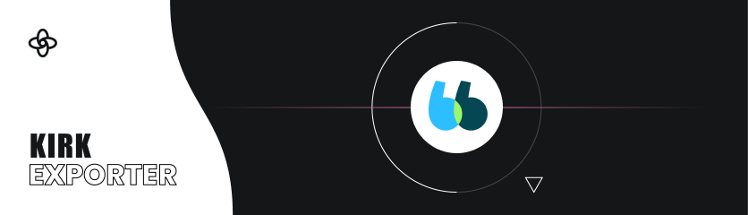

# Custom Exporter for Kairos, BlaBlaCar SPA

## TS

The exporter outputs three files.

`light.ts` and `dark.ts` exporting a single `tokens` object:

```ts
export const tokens = {
  border,
  color,
  size,
  shadow,
  font,
  radius,
  misc,
}
```

For each of token's keys, you will find a collection of key/values.

Here is an extract of what you can find in `tokens.color` for `light.ts`.

```ts
const color = {
  txtPrimary: 'hsla(189, 89%, 17%, 1)',
  txtSecondary: 'hsla(189, 13%, 50%, 1)',
  txtPlaceholder: 'hsla(189, 13%, 50%, 1)',
  txtHelper: 'hsla(189, 13%, 50%, 1)',
  txtHighlighted: 'hsla(190, 23%, 31%, 1)',
  txtError: 'hsla(351, 90%, 60%, 1)',
  txtSuccess: 'hsla(125, 56%, 59%, 1)',
  txtWarning: 'hsla(34, 100%, 48%, 1)',
  ...
}
```


The exporter also produces a `tokenCollection.ts` file exporting a `tokenCollection` array listing a detailed view of all available tokens:

```ts
export const tokenCollection = [
  {
    name: 'txtPrimary',
    type: 'color',
    theme: 'light',
    description: '',
    rgba: 'rgba(5, 71, 82, 1)',
    hex: '#054752',
    value: 'hsla(189, 89%, 17%, 1)',
    id: 'S:57ce944425d7fc447204ad4419a6f3f3c39c06f2,',
  },
  {
    name: 'txtSecondary',
    type: 'color',
    theme: 'light',
    description: '',
    rgba: 'rgba(112, 140, 145, 1)',
    hex: '#708c91',
    value: 'hsla(189, 13%, 50%, 1)',
    id: 'S:996a4a8133ae8b35b0dda66557bdcb206f17df50,',
  },
  {
    name: 'txtPlaceholder',
    type: 'color',
    theme: 'light',
    description: '',
    rgba: 'rgba(112, 140, 145, 1)',
    hex: '#708c91',
    value: 'hsla(189, 13%, 50%, 1)',
    id: 'S:904334083536f3406fe23fe9058218e1f7dcb4c1,',
  },
  ...
];
```

This file is there for documentation use.


## How to edit 

Follow [Supernova's own documentation](https://developers.supernova.io/latest/supernova-developer-platform.html). 

> Fair warning, for local testing using VSCode and the Supernova plugin will be necessary
